# Web Challenge 2: Logged In

Writeup by [@redfl4g](https://github.com/redfl4g)

## Overview/TLDR
This was a frustrating yet interesting challenge to solve, as it involved learning the basics about ExpressJS Middleware as well as dissecting the code to understand it's processing functions from external libraries.

The main vulnerability in this challenge was the improper use of an external library ([express-validator](https://express-validator.github.io/)) that attempts to validate request parameters/user inputs. With improper validation, users are able to bypass the login authenticator function, which led to the flow of execution to sections where only (supposedly) authenticated users are allowed to execute.

<br>

## Challenge Description

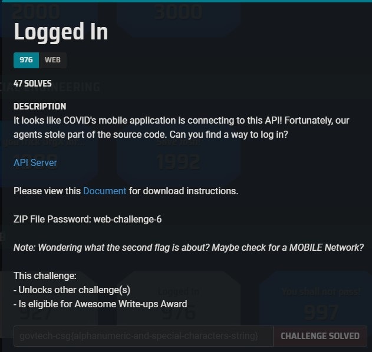

> API Server URL: http://yhi8bpzolrog3yw17fe0wlwrnwllnhic.alttablabs.sg:41061/api

## Introduction
We were provided with the source codes for the API

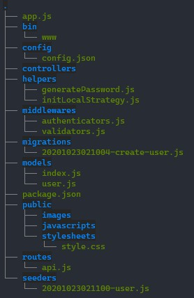

Analyzing the source codes and searching Google, we identified that it is an ExpressJS Middleware application, that does error handling and validation on two request parameters, ```username``` and ```password```, before attempting to authenticate the specified credentials.


### Initial Observations (API login flow) 
1. User sends a POST request to ```http://yhi8bpzolrog3yw17fe0wlwrnwllnhic.alttablabs.sg:41061/api/login```, specifying a ```username``` and ```password```

2. The API application first checks if the parameters ```username``` and ```password``` exists. 

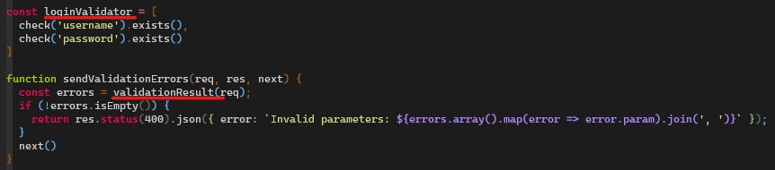

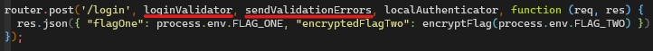

This validation check is performed by calling express-validator's function ```validationResult``` which uses the validation criteria specified by the ```check('xxx')``` function, in ```const loginValidator```. If both the ```username``` and ```password``` parameters exist, ```validationResult``` will return will no errors, and the program will continue it's flow.


If either one does not exist, a Status 400 error will be returned, stating that specific parameters were invalid


3. Following the flow after ```sendValidationErrors``` returns no errors, ```loginAuthenticator``` will be executed

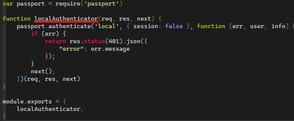

If a user is successfully authenticated, it will return to the ```router.post``` section and continue its flow with no errors, and returning the user a JSON response with the flag. 

<br>

> Read: [Build and Understand Express Middleware through Examples](https://developer.okta.com/blog/2018/09/13/build-and-understand-express-middleware-through-examples)

> Watch: [Learn Express Middleware in 14 Minutes](https://www.youtube.com/watch?v=lY6icfhap2o)

### Head Scratching Intensifies
After a few hours of researching, searching for known vulnerabilities and for any improper/insecure codes, it yielded no results..

In a desperate attempt, we started to fuzz the API with different credentials to observe any unexpected behaviour returned..when suddenly, we get the flag ```govtech-csg{m!sS1nG_cR3DeN+!@1s}``` when we sent a POST request with both empty ```username``` and ```password``` parameters!!

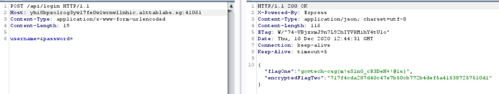


<br>

### What happened and why did it work?
Before we face-palmed ourselves for missing something obvious or making a mistake in our initial analysis, we decided to take a step back and re-evaluate the validation and authentication process, to understand how and why specifying empty parameters worked.

Firstly, by omitting either the ```username``` or ```password``` parameter, we received an error stating that a parameter were invalid. Therefore, the ```username``` and ```password``` parameters **must** be present.

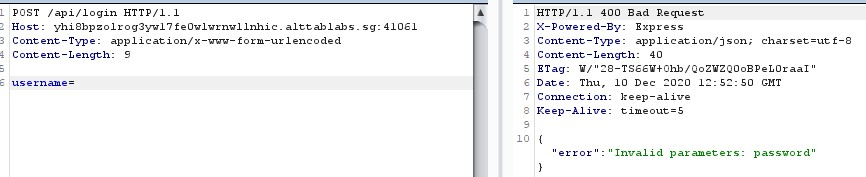

Secondly, by specifying any value for ```username``` and ```password```, we received an "invalid credentials" error, as expected.

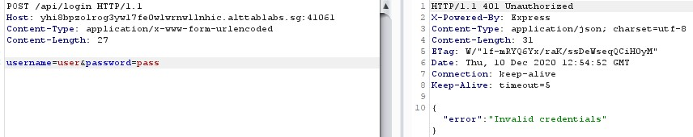

Further inspection of the validation checks, the ```exists()``` function in ```const loginValidator``` could have an improper implementation for a login input validation.

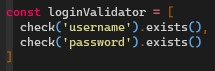

Researching about the ```exists()``` function, it seems that this criteria for validation only checks if the specified parameter **ONLY** returns ***false*** if the parameter is of type ```undefined```. This means that by specifying the ```username``` and ```password``` parameters with no values in the POST request, these parameters will be defined, and is of type ```null```, resulting in a bypass of the validation check called by ```validationResult(req)``` as the criteria are met.

> Read: [Should .exists() check for null values as well?](https://github.com/express-validator/express-validator/issues/473)

Because the ```validationResult(req)``` results in no errors, it passes the ```if``` statement and flows to call ```next()```, which resumes the flow of execution back in ```router.post```.

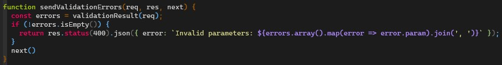

Following the flow, the next middleware function in line is the ```localAuthenticator``` function. This login function uses a widely used authentication middleware library, called [```Passport```](http://www.passportjs.org/). 

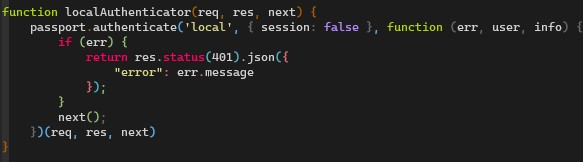

So ultimately, how did bypassing the validation functions help in execution of authenticated code, if we still have to get past the authentication function? As the ```null``` parameters are passed into the authentication function, ```passport.authenticate``` will attempt to authenticate a user based on the ```username``` parameter. However, as both credentials are ```null```, the application is unable to retrieve a valid user model (from db or storage), and does not return an error. This flows the execution down toward the ```next()``` function which flows back to ```router.post``` and executes the supposedly authenticated code (returns the flag). 

<br>

## Improper Validation
Regarding the ```express-validator``` validation checks, the validation bypass with null values could be fixed by specifying ```checkFalsy: true```, to classify ```"", '0', 'false', null``` values as parameters that does not exist (exists() will return false). 
```javascript
const loginValidator = [
	check('username').exists({ checkFalsy: true }),
	check('password').exists({ checkFalsy: true })
]
```

Regarding the ```loginAuthenticator``` function, instead of specifying a ```next()``` function at the end of the code, there should be a check if the ```user``` model is valid and authenticated, and return an error.
```javascript
function localAuthenticator(req, res, next) {
	passport.authenticate('local', { session: false }, function (err, user, info) {
		if (err) {
			return res.status(401).json({
				"error": err.message
			});
		}
		if (! user) {
			return res.send(401,{ success: false, message: 'authentication failed' });
		}
		else{
			// Authenticated
		}
	})(req, res, next)
}
```

<br>

## Conclusion
Even though we got the flag by luck before actually understanding the vulnerability, this challenge was a great learning experience to dissect and try to understand what was going on behind the scenes, and how blind trust to external library and improper usage of them can be devastating in real world applications. 
